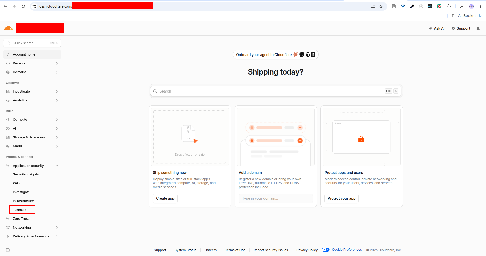
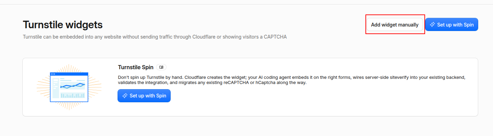
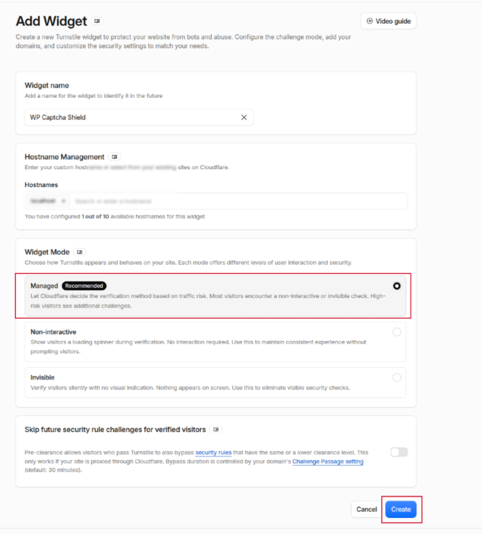
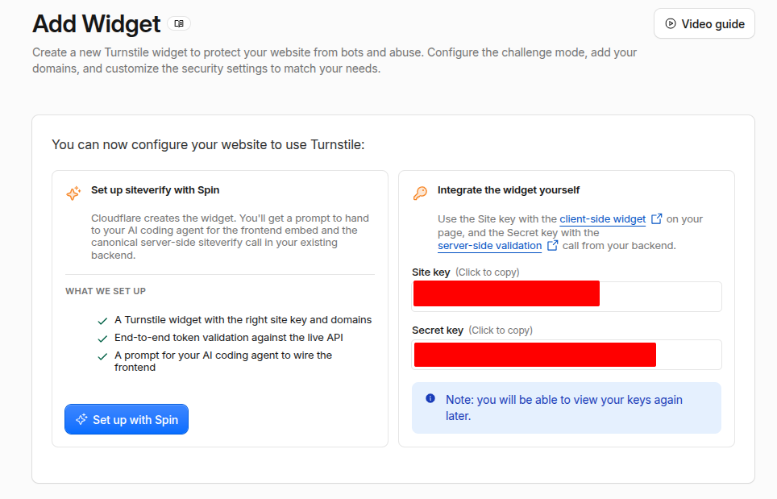
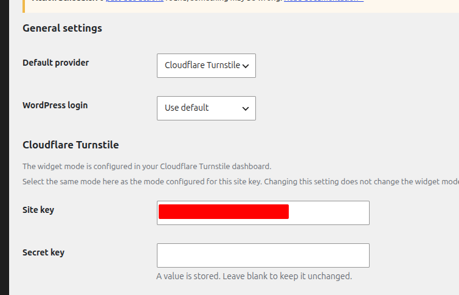

# Configure Cloudflare Turnstile

This guide explains how to create a Cloudflare Turnstile widget and connect it
to WP Captcha Shield.

WP Captcha Shield supports:

- **Managed** — default and recommended
- **Non-Interactive**
- **Invisible**

The mode selected in WP Captcha Shield must match the mode configured for the
site key in Cloudflare. Changing the plugin setting does not change the widget
mode in Cloudflare.

> **Current form support:** WordPress login is implemented. Other WordPress
> and WooCommerce form integrations remain planned.

## Before you begin

You need a Cloudflare account, a WordPress administrator account, WP Captcha
Shield installed, and the hostname where Turnstile will run.

Your website does not need to use Cloudflare DNS, proxying, or CDN services to
use Turnstile.

## 1. Open Turnstile in Cloudflare

Sign in to the Cloudflare dashboard. Under **Protect & connect**, expand
**Application security**, then select **Turnstile**.



## 2. Add a widget manually

On the **Turnstile widgets** page, select **Add widget manually**.



## 3. Configure the widget

### Widget name

Enter a descriptive name, for example:

```text
example.com - WP Captcha Shield
```

Use a separate name for a staging widget when appropriate.

### Hostname management

Enter only the hostname where the widget will run.

Correct:

```text
example.com
staging.example.com
shop.example.com
```

Incorrect:

```text
https://example.com
example.com:443
example.com/wp-login.php
*.example.com
```

Do not include a protocol, port, path, or wildcard. Adding a root hostname such
as `example.com` also authorizes its subdomains. Adding a specific subdomain
limits the widget to that subdomain and its children.

### Widget mode

Choose one mode:

- **Managed** — recommended. Cloudflare decides whether additional visitor
  interaction is needed.
- **Non-Interactive** — displays a verification widget without asking the
  visitor to interact with it.
- **Invisible** — runs without showing a widget or progress indicator.

Cloudflare requires sites using Invisible Turnstile to reference the
[Turnstile Privacy Addendum](https://www.cloudflare.com/turnstile-privacy-policy/)
in their own privacy policy.

### Pre-clearance

Leave **Skip future security rule challenges for verified visitors** disabled
unless the site is proxied through Cloudflare and you intentionally want
Turnstile verification to issue pre-clearance for applicable security rules.

Select **Create**.



## 4. Copy the site key and secret key

Cloudflare displays the credentials under **Integrate the widget yourself**.
Copy:

- the **Site key** for the public browser widget;
- the **Secret key** for server-side validation.



Keep the secret key private. Do not put it in frontend JavaScript, public
screenshots, public documentation, Git commits, support messages, or
browser-visible HTML.

## 5. Configure WP Captcha Shield

In WordPress administration, open:

```text
Settings → WP Captcha Shield
```

The example configuration is:

```text
Default provider: Cloudflare Turnstile
WordPress login: Use default
```

This causes WordPress login to inherit Cloudflare Turnstile from the global
default. You may instead select **Cloudflare Turnstile** directly for the
WordPress login override.

In the **Cloudflare Turnstile** section:

1. paste the Cloudflare **Site key**;
2. paste the Cloudflare **Secret key**;
3. select the same **Mode** configured for the site key in Cloudflare;
4. save the settings.



After the secret key is saved, the plugin does not display it again. Leave the
secret-key field blank during later saves to keep the stored value unchanged.
The plugin warns when the Turnstile site key or secret key is missing.

## 6. Match the mode in both places

| Cloudflare dashboard | WP Captcha Shield |
|---|---|
| Managed | Managed |
| Non-Interactive | Non-Interactive |
| Invisible | Invisible |

Cloudflare controls the widget attached to the site key. WP Captcha Shield uses
its mode setting to choose the matching frontend integration. Changing one does
not update the other.

## 7. Local development

Cloudflare test keys work on development hostnames such as `localhost`,
`127.0.0.1`, and `0.0.0.0`.

### Visible widget that always passes

```text
Site key: 1x00000000000000000000AA
Secret key: 1x0000000000000000000000000000000AA
```

### Invisible widget that always passes

```text
Site key: 1x00000000000000000000BB
Secret key: 1x0000000000000000000000000000000AA
```

Cloudflare also provides predictable failure keys. See the official
[testing documentation](https://developers.cloudflare.com/turnstile/troubleshooting/testing/)
for the full list.

Recommended separation:

```text
Local development: Cloudflare test keys
Production: Real widget, production hostname, and real keys
```

Cloudflare allows local hostnames on a real widget, but recommends that
production site keys do not authorize `localhost` or `127.0.0.1`.

## 8. Test the integration

Use a private or incognito browser session.

1. Open the WordPress login page.
2. Confirm the expected appearance for the selected mode.
3. Submit valid login credentials.
4. Confirm that login succeeds after successful verification.
5. Test an invalid or failed verification condition.
6. Confirm that the protected action is rejected rather than bypassing
   verification.

WP Captcha Shield performs server-side validation. This is required because a
Turnstile token can be invalid, expired, forged, or already used. Tokens expire
after five minutes and can be validated only once.

## 9. Change an existing widget

To modify a widget:

1. open **Turnstile** in the Cloudflare dashboard;
2. select the widget;
3. open **Settings**;
4. update the hostname or mode;
5. save the widget;
6. update WP Captcha Shield when the mode or credentials change.

When rotating the secret key, update WP Captcha Shield with the new value.
Cloudflare provides a temporary overlap period during rotation so the old and
new secrets can remain valid while the integration is updated.

## Troubleshooting

### “Cloudflare Turnstile configuration is incomplete”

The plugin is missing the site key, secret key, or both.

### The widget does not load

Check that:

- the browser hostname is authorized in Cloudflare;
- the site key is correct;
- the plugin mode matches the Cloudflare mode;
- another plugin is not blocking the Turnstile script;
- the site Content Security Policy permits `challenges.cloudflare.com`.

### The widget reports an invalid hostname

Use only the hostname:

```text
example.com
```

Do not use a complete URL:

```text
https://example.com/wp-login.php
```

### The visible behaviour does not match the selected mode

Check the mode in both the Cloudflare dashboard and
**Settings → WP Captcha Shield**. They must match.

### Invisible mode has no privacy disclosure

Reference Cloudflare's
[Turnstile Privacy Addendum](https://www.cloudflare.com/turnstile-privacy-policy/)
in the site's privacy policy.

### Login fails after waiting on the page

Turnstile tokens expire after five minutes. Reload or retry the form so a new
token can be generated.

## Official Cloudflare references

- [Turnstile overview](https://developers.cloudflare.com/turnstile/)
- [Create and manage widgets](https://developers.cloudflare.com/turnstile/get-started/widget-management/dashboard/)
- [Hostname management](https://developers.cloudflare.com/turnstile/additional-configuration/hostname-management/)
- [Widget modes](https://developers.cloudflare.com/turnstile/concepts/widget/)
- [Server-side validation](https://developers.cloudflare.com/turnstile/get-started/server-side-validation/)
- [Testing keys](https://developers.cloudflare.com/turnstile/troubleshooting/testing/)
- [Rotate the secret key](https://developers.cloudflare.com/turnstile/troubleshooting/rotate-secret-key/)
