# Configure Google reCAPTCHA

This guide explains how to create a Google reCAPTCHA key and connect it to WP Captcha Shield.

WP Captcha Shield supports:

- **Score-based** — default and recommended
- **Checkbox**
- **Invisible**

The mode selected in WP Captcha Shield must match the integration type configured for the reCAPTCHA site key. Changing the plugin setting does not change the key type in Google Cloud.

## Before you begin

You need:

- a Google account;
- a Google Cloud project;
- access to create reCAPTCHA keys and API credentials in that project;
- a WordPress administrator account;
- WP Captcha Shield installed;
- the hostname where reCAPTCHA will run.

Google recommends using separate reCAPTCHA keys for development, staging, and production environments. This keeps test traffic separate from production risk data.

## 1. Open Fraud Defense

Sign in to the Google Cloud console.

From the main navigation menu, open:

```text
Security → Fraud Defense
```

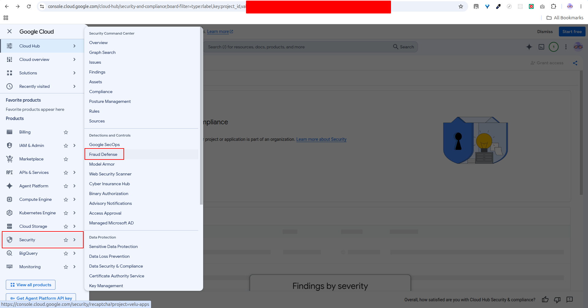

Make sure the correct Google Cloud project is selected before continuing.

## 2. Start reCAPTCHA setup

On the Fraud Defense dashboard, select **Set up reCAPTCHA protection**.

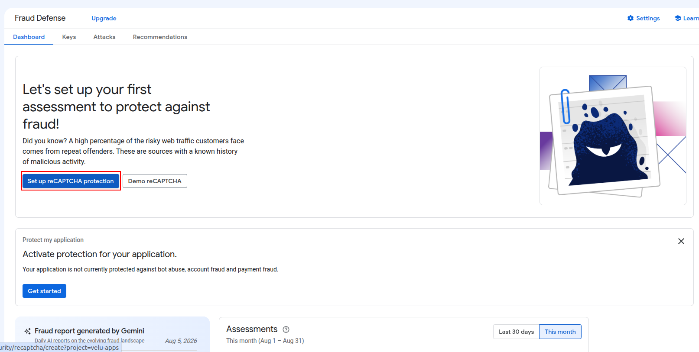

## 3. Create a reCAPTCHA key

Enter a descriptive display name, for example:

```text
example.com - WP Captcha Shield
```

For a local score-based test key, a name such as this is also suitable:

```text
WP Captcha Shield Score
```

### Application type

Select:

```text
Web
```

WP Captcha Shield integrates reCAPTCHA into browser-based WordPress forms.

### Domain list

Enter only the hostname where the key will be used.

Examples:

```text
example.com
www.example.com
staging.example.com
localhost
```

Do not enter a complete URL or page path.

Incorrect:

```text
https://example.com
https://example.com/wp-login.php
example.com:443/wp-login.php
```

Use a separate development key for `localhost` and other non-production hostnames.

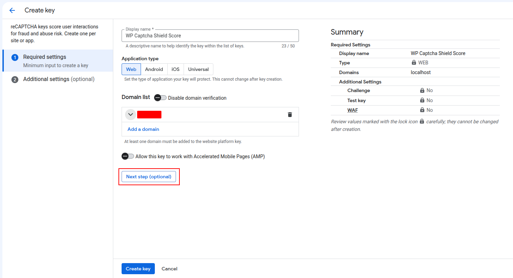

### Additional settings

Google provides optional controls for:

- enabling challenges;
- creating a testing-only key;
- enabling the key for a supported Web Application Firewall.

For a score-based production key, leave **Will you use challenges?** disabled unless you intentionally want a challenge-based integration.

For local development, you may enable **Are you creating this key for testing purposes only?** and choose a fixed score. Testing keys cannot be converted into production keys.

Leave the WAF option disabled unless the key will be used with a supported WAF integration.

Select **Create key**.

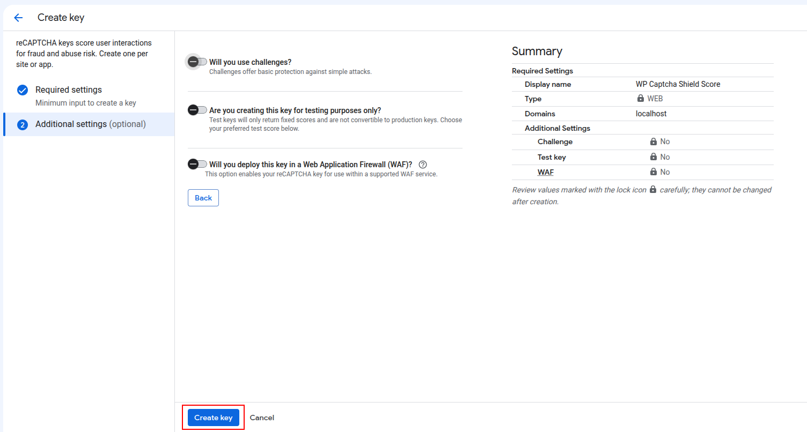

## 4. Copy the reCAPTCHA site key

After creating the key, Google opens its **Key details** page.

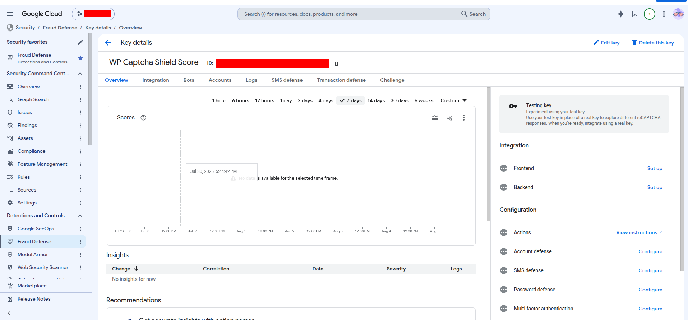

To view the complete key details, select **Edit key**.

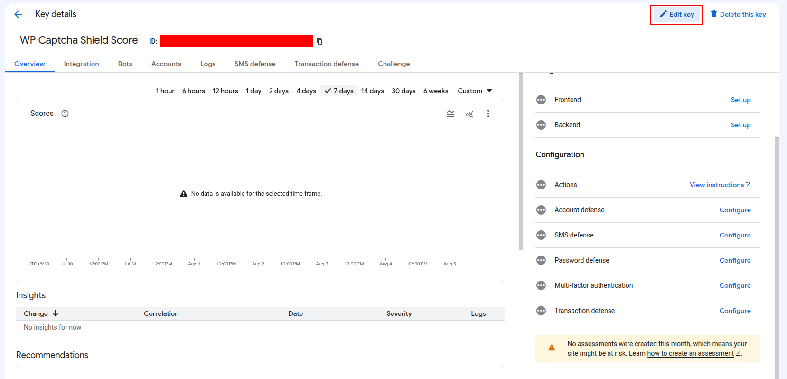

Google displays both an **ID** and a **Secret key**.

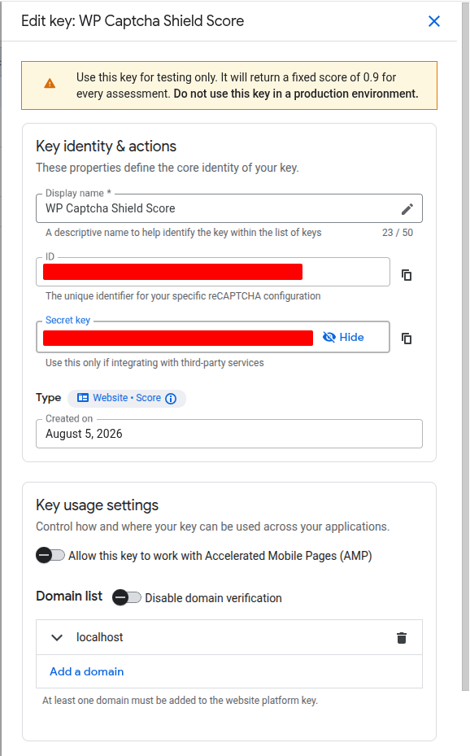

Use the credentials as follows:

| Google value | WP Captcha Shield |
|---|---|
| ID | Site key |
| Secret key | Not used by the current plugin |

The **ID** is the reCAPTCHA site key used by WP Captcha Shield.

> **Important:** Do not paste the reCAPTCHA **Secret key** into the plugin's **API key** field. The secret key and Google Cloud API key are different credentials.

The site key is browser-visible and is not treated as a secret. The reCAPTCHA secret key should still remain private even though the current plugin does not use it.

## 5. Locate or create the Google Cloud API key

WP Captcha Shield performs server-side assessments through the reCAPTCHA Enterprise API. Those requests use a Google Cloud **API key**.

Open:

```text
APIs & Services → Credentials
```

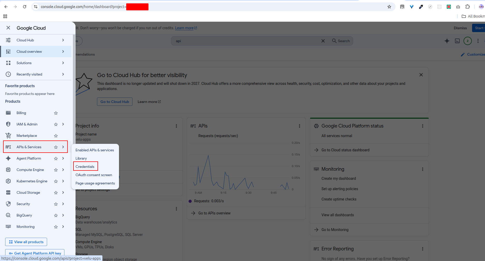

If an appropriate API key already exists, locate it under **API Keys** and select **Show key**.

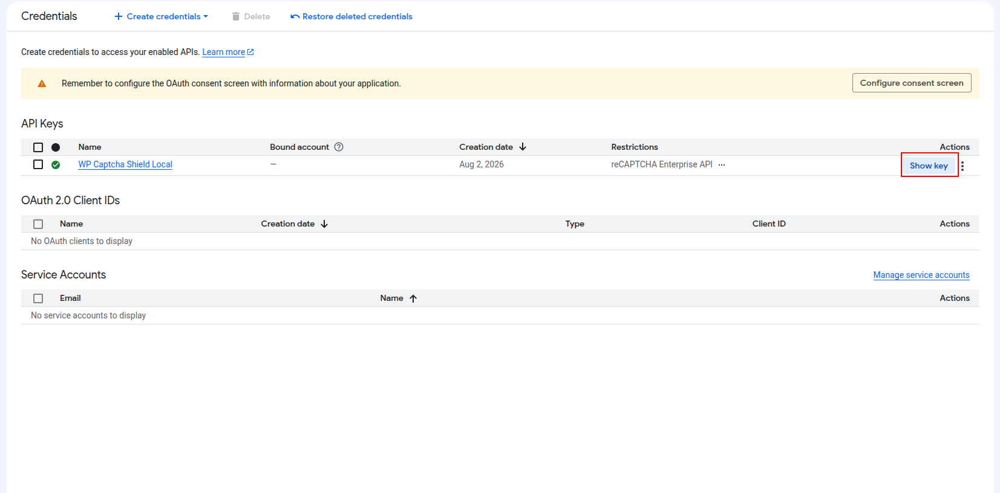

Copy the displayed API key.

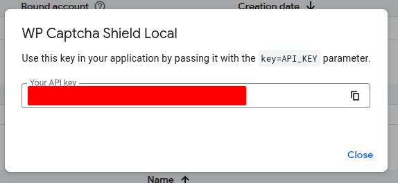

The API key is normally a string beginning with a prefix such as:

```text
AIza...
```

Keep it private. Do not place it in frontend JavaScript, browser-visible HTML, public screenshots, public documentation, Git commits, or support messages.

### Create an API key when none exists

From the Credentials page, select:

```text
Create credentials → API key
```

Give it a descriptive name, for example:

```text
WP Captcha Shield assessment API
```

### Restrict the API key

Restrict the API key to:

```text
reCAPTCHA Enterprise API
```

When the WordPress server has a stable outbound IP address, you may also apply an IP-address application restriction.

Do not use an HTTP-referrer restriction for this API key. WP Captcha Shield sends assessment requests from the WordPress server, not from the visitor's browser.

## 6. Understand the three required values

WP Captcha Shield requires three Google values:

| Plugin field | Google source |
|---|---|
| Project ID | Google Cloud project ID |
| API key | APIs & Services → Credentials |
| Site key | Fraud Defense reCAPTCHA key → ID |

The reCAPTCHA **Secret key** shown in the key editor is not used by the current plugin.

This distinction is important:

```text
Site key   = reCAPTCHA key ID
API key    = Google Cloud API credential
Secret key = not used by WP Captcha Shield
```

## 7. Configure WP Captcha Shield

In WordPress administration, open:

```text
Settings → WP Captcha Shield
```

Under **General settings**, select:

```text
Default provider: Google reCAPTCHA
WordPress login: Use default
```

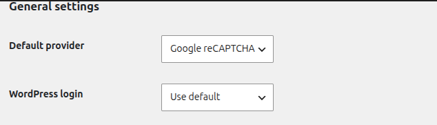

This causes WordPress login to inherit Google reCAPTCHA from the global default. You may instead select **Google reCAPTCHA** directly for the WordPress login override.

In the **Google reCAPTCHA** section:

1. enter the Google Cloud **Project ID**;
2. paste the Google Cloud **API key**;
3. paste the reCAPTCHA **ID** into the **Site key** field;
4. select the same **Mode** as the reCAPTCHA key type;
5. enter the **Minimum score**;
6. save the settings.

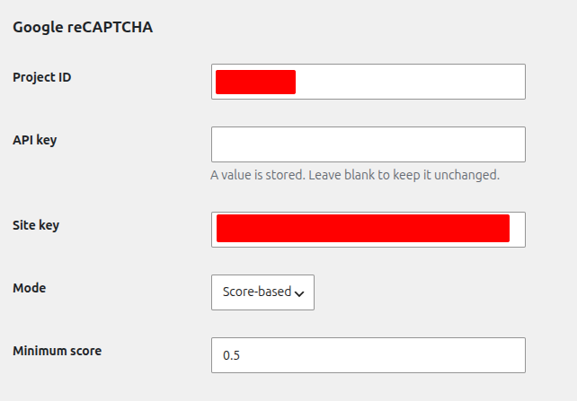

After the API key is saved, the plugin does not display it again. Leave the API-key field blank during later saves to keep the stored value unchanged.

The plugin warns when the Project ID, API key, or site key is missing.

## 8. Match the mode in both places

| Google reCAPTCHA configuration | WP Captcha Shield |
|---|---|
| Website key without challenges | Score-based |
| Website key with a checkbox challenge | Checkbox |
| Website key with an invisible challenge | Invisible |

Google controls the behaviour attached to the site key. WP Captcha Shield uses its mode setting to load the matching frontend integration and evaluate the assessment correctly.

Changing the mode in WP Captcha Shield does not convert the key in Google Cloud.

When moving to a different mode, create or edit a compatible reCAPTCHA key and update both the site key and mode in WP Captcha Shield.

### Using Checkbox mode

Checkbox mode requires a Web reCAPTCHA key configured to use challenges.

In Google Cloud:

1. create or edit a Web reCAPTCHA key;
2. enable **Will you use challenges?**;
3. select the checkbox challenge option when available;
4. save the key.

In WP Captcha Shield:

1. enter the key ID as the **Site key**;
2. select **Checkbox** as the mode;
3. keep the Project ID and Google Cloud API key configured;
4. save the settings.

WP Captcha Shield renders Google's visible checkbox widget. Google may present an additional challenge when required.

### Using Invisible mode

Invisible mode also requires a Web reCAPTCHA key configured to use challenges.

In Google Cloud:

1. create or edit a Web reCAPTCHA key;
2. enable **Will you use challenges?**;
3. select the invisible challenge option when available;
4. save the key.

In WP Captcha Shield:

1. enter the key ID as the **Site key**;
2. select **Invisible** as the mode;
3. keep the Project ID and Google Cloud API key configured;
4. save the settings.

WP Captcha Shield loads the Google script with explicit rendering, creates an invisible widget, and executes it automatically when the protected form is submitted. The visitor normally sees no checkbox, but Google may display a challenge when additional verification is required.

> **Important:** Selecting **Invisible** only in WP Captcha Shield does not convert a score-based or checkbox key into an invisible key. The Google key configuration and plugin mode must match.

## 9. Configure the minimum score

Google score-based assessments return a score between:

```text
0.0 and 1.0
```

A score closer to `1.0` generally indicates that the interaction is more likely to be legitimate. A score closer to `0.0` indicates a higher likelihood of automated or abusive activity.

WP Captcha Shield uses:

```text
0.5
```

as the default minimum score.

General guidance:

| Minimum score | Behaviour |
|---|---|
| `0.3` | More permissive |
| `0.5` | Balanced default |
| `0.7` | More restrictive |
| `0.9` | Very restrictive |

Start with `0.5` unless the website has evidence supporting a different threshold. Monitor legitimate-user failures before increasing it.

The minimum score applies to **Score-based** and **Invisible** modes. Checkbox mode does not use the score threshold.

## 10. Local development

Use a separate reCAPTCHA key for local development.

Add the development hostname to that key, for example:

```text
localhost
127.0.0.1
```

Do not add local hostnames to the production key.

For score-based development keys, Google can be configured to return a fixed testing score.

Examples:

```text
Passing test score: 0.9
Failing test score: 0.1
```

With the plugin's default minimum score of `0.5`, the first value should pass and the second should fail.

Recommended separation:

```text
Local development: Development key and fixed testing behaviour
Staging: Separate staging key
Production: Production domain and production key
```

Do not use a testing-only key in production.

## 11. Test the integration

Use a private or incognito browser session.

1. Open the WordPress login page.
2. Confirm the expected appearance for the selected mode.
3. Submit valid login credentials.
4. Confirm that login succeeds after successful reCAPTCHA verification.
5. Test a low-score, invalid, expired, or failed verification condition.
6. Confirm that the protected action is rejected rather than bypassing verification.

WP Captcha Shield sends the token to the Google reCAPTCHA Enterprise assessment endpoint from the server.

The assessment request includes:

- the token generated in the browser;
- the configured site key;
- the expected action when one is available;
- the visitor IP address when available;
- the visitor user agent when available.

The plugin validates:

- that Google considers the token valid;
- that the returned action matches the expected action;
- that a score is present when required;
- that the score meets the configured minimum.

A reCAPTCHA token can be used only once and expires after approximately two minutes. Generate a new token when the form is submitted again.

## 12. Change an existing key

To modify a reCAPTCHA key:

1. open **Fraud Defense** in Google Cloud;
2. open **Keys**;
3. select the key;
4. select **Edit key**;
5. update its domain list or supported settings;
6. save the key.

Some key characteristics cannot be changed after creation. When changing to a different integration type, create a new key and update WP Captcha Shield with the new site key and matching mode.

When rotating the Google Cloud API key:

1. create a replacement API key;
2. restrict it to the reCAPTCHA Enterprise API;
3. enter the new API key in WP Captcha Shield;
4. test the integration;
5. disable or delete the old API key after confirming the replacement works.

## Troubleshooting

### “Google reCAPTCHA configuration is incomplete”

The plugin is missing one or more of:

- Project ID;
- API key;
- site key.

Enter all three values and save the settings.

### The API key field was filled with the reCAPTCHA secret key

The reCAPTCHA secret key and Google Cloud API key are different.

Use:

```text
APIs & Services → Credentials
```

to locate or create the Google Cloud API key.

Use the reCAPTCHA key **ID** as the plugin's site key.

### The widget or badge does not load

Check that:

- the browser hostname is authorized for the site key;
- the site key is correct;
- the plugin mode matches the Google key integration type;
- another plugin is not blocking the Google reCAPTCHA script;
- the site's Content Security Policy permits the required Google resources;
- browser privacy or content-blocking extensions are not blocking the script.

### The site key is invalid

Confirm that:

- the key was created for the **Web** application type;
- the key belongs to the selected Google Cloud project;
- the copied value is the reCAPTCHA key **ID**;
- the plugin mode matches the key type.

### The API returns an authentication or permission error

Check that:

- the reCAPTCHA Enterprise API is enabled;
- the API key belongs to the configured Google Cloud project;
- the API key has not been deleted or disabled;
- the API restriction permits the reCAPTCHA Enterprise API;
- an IP-address restriction, when present, matches the WordPress server's actual outbound IP address.

### The API reports that the project does not exist

WP Captcha Shield requires the Google Cloud **Project ID**.

Do not enter only the project display name or numeric project number.

A Project ID commonly resembles:

```text
wp-captcha-example-123456
```

### The browser hostname is rejected

Add the hostname to the reCAPTCHA key's domain list.

For local development, add:

```text
localhost
```

only to a separate development key.

### Score-based verification rejects legitimate users

Start with:

```text
0.5
```

Lower the threshold gradually when legitimate users are rejected. Do not lower it without considering the website's abuse risk.

### Login fails after waiting on the page

Google reCAPTCHA tokens expire after approximately two minutes and can be assessed only once.

Reload or retry the form so the browser can generate a new token.

### The API key is visible in the WordPress settings page

After the API key is saved, WP Captcha Shield should not display its stored value. Leave the field blank during later saves to preserve the current key.

Enter a value only when initially configuring or replacing the API key.

## Official Google references

- [Prepare your environment for reCAPTCHA](https://cloud.google.com/recaptcha/docs/prepare-environment)
- [Choose the appropriate key type](https://cloud.google.com/recaptcha/docs/choose-key-type)
- [Create reCAPTCHA keys for websites](https://cloud.google.com/recaptcha/docs/create-key-website)
- [reCAPTCHA keys overview](https://cloud.google.com/recaptcha/docs/keys)
- [Create assessments for websites](https://cloud.google.com/recaptcha/docs/create-assessment-website)
- [Manage API keys](https://cloud.google.com/docs/authentication/api-keys)
- [Edit or delete reCAPTCHA keys](https://cloud.google.com/recaptcha/docs/manage-keys)
- [Troubleshoot reCAPTCHA integration issues](https://cloud.google.com/recaptcha/docs/troubleshoot-recaptcha-issues)
