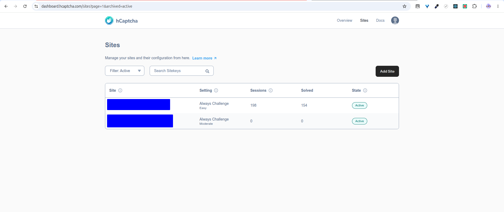
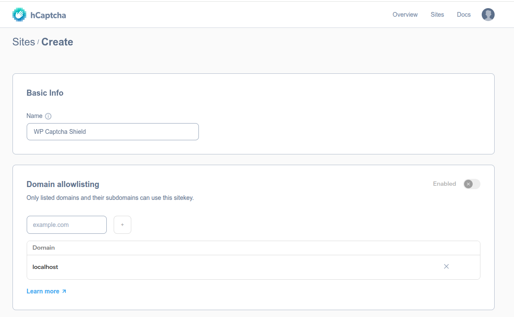
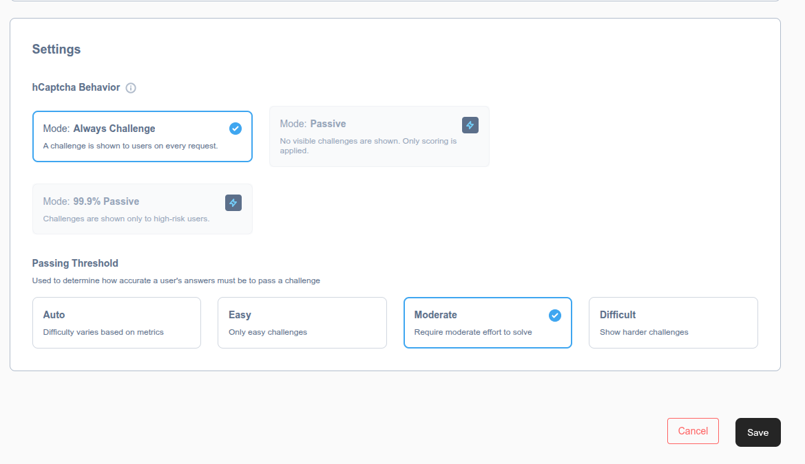
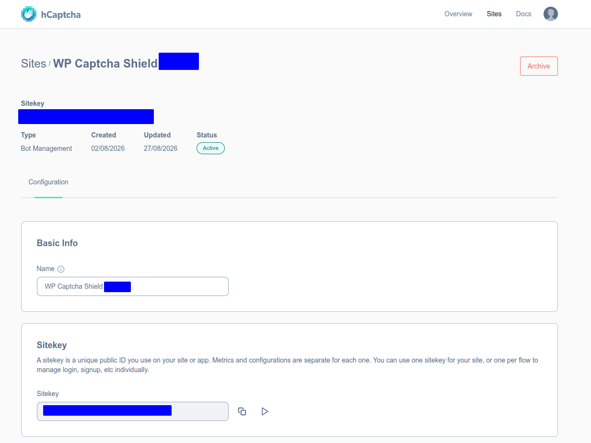
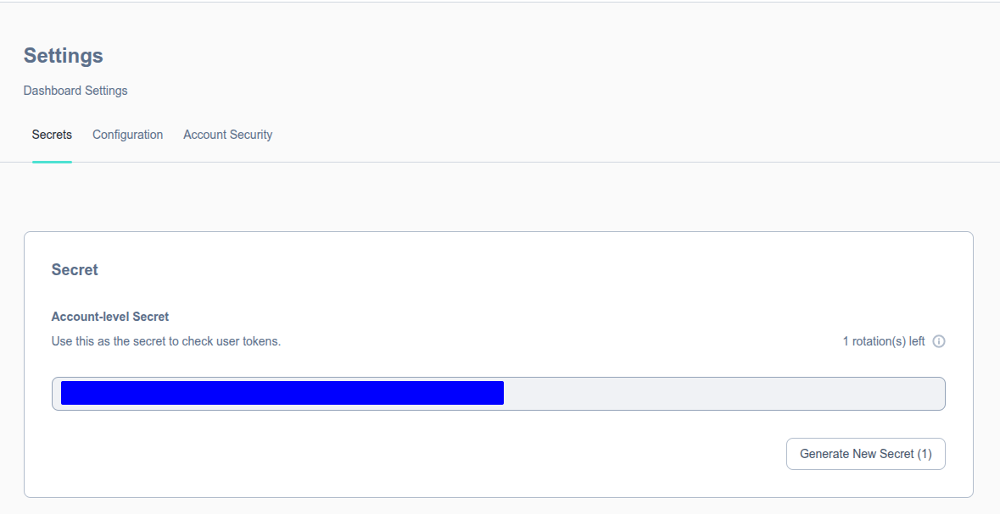
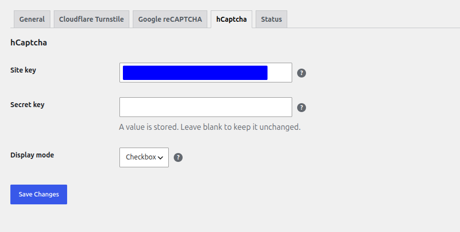
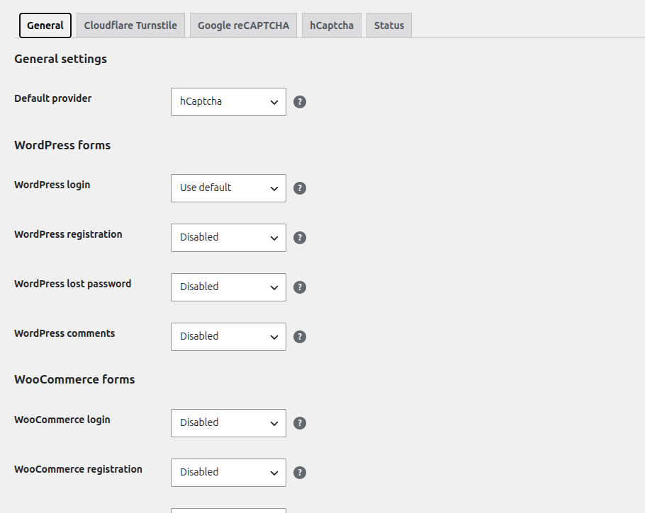
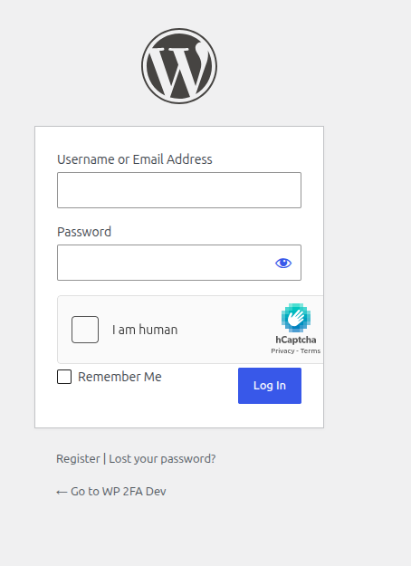

# Configure hCaptcha

This guide explains how to create an hCaptcha site and connect it to
WP Captcha Shield.

WP Captcha Shield supports:

- **Checkbox** — default
- **Invisible**

WP Captcha Shield controls how hCaptcha is presented on protected forms.
hCaptcha account and site-key settings continue to control provider-side
behavior such as challenge behavior and difficulty.

## Before you begin

You need:

- an hCaptcha account;
- a WordPress administrator account;
- WP Captcha Shield installed and activated;
- the hostname where hCaptcha will run.

## 1. Open the hCaptcha Sites dashboard

Sign in to the hCaptcha dashboard and open **Sites**.

Select **Add Site** to create a new site configuration.

## 2. Create the site

Enter a descriptive name for the site.

If you use domain allowlisting, add the hostname where WP Captcha Shield will
run.

Configure the hCaptcha behavior and passing threshold appropriate for your
site, then save the configuration.

These are hCaptcha-side settings. They are separate from the **Checkbox** and
**Invisible** display modes configured in WP Captcha Shield.

## 3. Copy the site key

Open the site you created.

The **Sitekey** is the public identifier used by WP Captcha Shield to load
hCaptcha for protected forms.

Copy the site key.

## 4. Copy the secret key

Open the hCaptcha dashboard settings and select the **Secrets** section.

Copy the account-level secret used to verify submitted hCaptcha tokens.

Keep this value private.

## 5. Configure hCaptcha in WP Captcha Shield

In WordPress, go to:

    Settings → WP Captcha Shield

Open the **hCaptcha** tab.

Enter:

- the **Site key** from the hCaptcha site;
- the **Secret key** from the hCaptcha dashboard.

Then select the **Display mode**.

Available modes are:

### Checkbox

Displays the hCaptcha checkbox interface.

Checkbox is the default hCaptcha display mode in WP Captcha Shield.

### Invisible

Runs hCaptcha without displaying the normal checkbox.

hCaptcha may still require visitor interaction when additional verification is
needed.

Select **Save Changes** after configuring the provider.

## 6. Enable hCaptcha for protected forms

Open the **General** tab.

You can:

- select **hCaptcha** as the global default provider;
- set a form to **Use default** so it inherits hCaptcha; or
- select hCaptcha directly for an individual supported form.

You can also leave CAPTCHA disabled for forms that should not use protection.

For the complete provider-selection model, see the
[Form setup](../forms/index.md) guide.

## 7. Test hCaptcha

Open a protected form in a private browser session.

For Checkbox mode, confirm that the hCaptcha checkbox appears on the form.

Submit the form and confirm that:

1. successful hCaptcha verification allows the protected action;
2. failed verification rejects the protected action;
3. the expected hCaptcha integration loads for the selected form.

For Invisible mode, test the complete form submission rather than relying on a
visible widget.

For release or production validation, test hCaptcha on a real hostname.
Localhost behavior is not a reliable substitute for real-host validation,
especially for Invisible mode.

## Troubleshooting

If hCaptcha does not load or verification fails, confirm:

- the site key is correct;
- the secret key is correct;
- the hostname is allowed by the hCaptcha site configuration;
- the expected display mode is selected in WP Captcha Shield;
- outbound HTTP requests from WordPress are allowed;
- browser or Content Security Policy restrictions are not blocking hCaptcha;
- optimization or security plugins are not interfering with the provider
  scripts.

See the main [Troubleshooting](../troubleshooting/index.md) guide for additional
checks.
